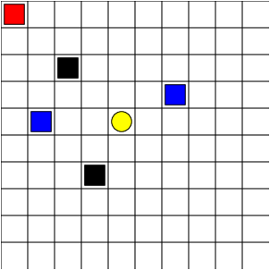
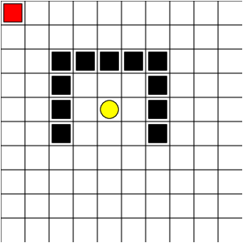

# Maze World 
Assignment code for course ECE 493 T25 at the University of Waterloo in Spring 2020.
(*Base code designed and created by Sriram Ganapathi Subramanian and Mark Crowley, 2020*)

## Domain Description - GridWorld
The domain consists of a 10x10 grid of cells. The agent being controlled is represented as a red square. The goal is a yellow oval and you receive a reward of 1 for reaching it, this ends and resets the episode.
Blue squares are **pits** which yield a penalty of -10 and end the episode. 
Black squares are **walls** which cannot be passed through. If the agent tries to walk into a wall they will remain in their current position and receive a penalty of -.3. Apart from these, the agent will receive a -0.1 for reaching any other cell in the grid as the objective is to move to the goal state as quickly as possible.
There are **three tasks** defined in `run_main.py` which can be commented out to try each. They include a combination of pillars, rooms, pits and obstacles. The aim is to learn a policy that maximizes expected reward and reaches the goal as quickly as possible.

# 

## Implemented using
- Value Iteration
- Policy Iteration
- SARSA
- QLearning
- Expected SARSA
- Double Q-Learning
- SARSA Lambda (Eligibility Traces)